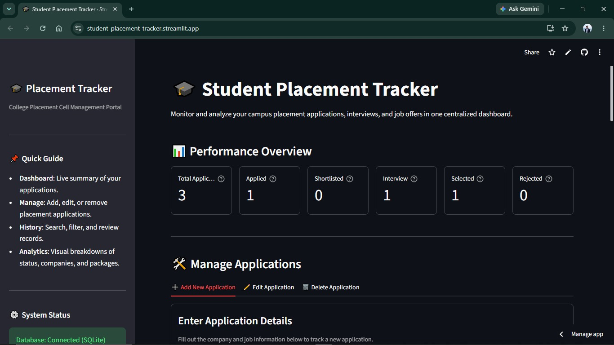
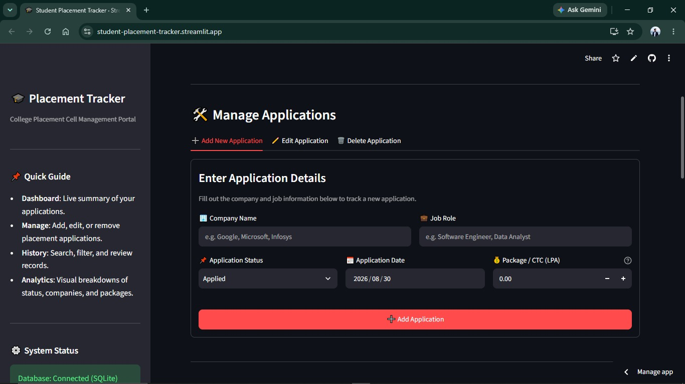
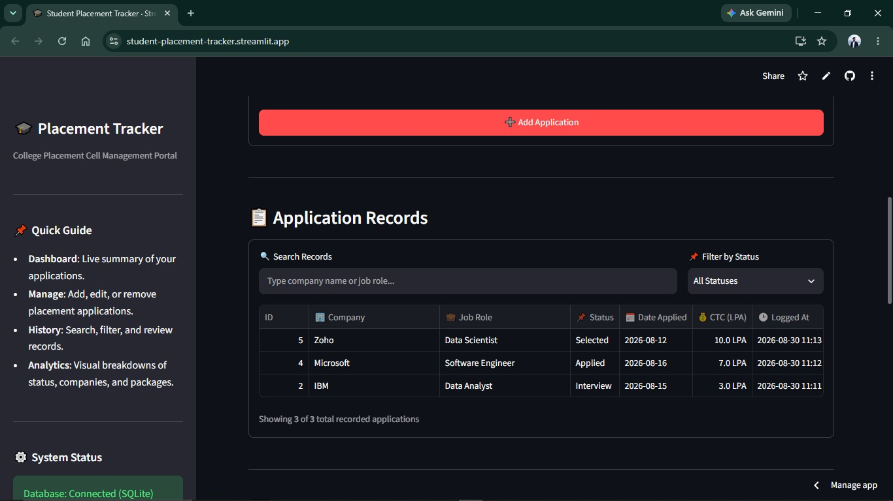
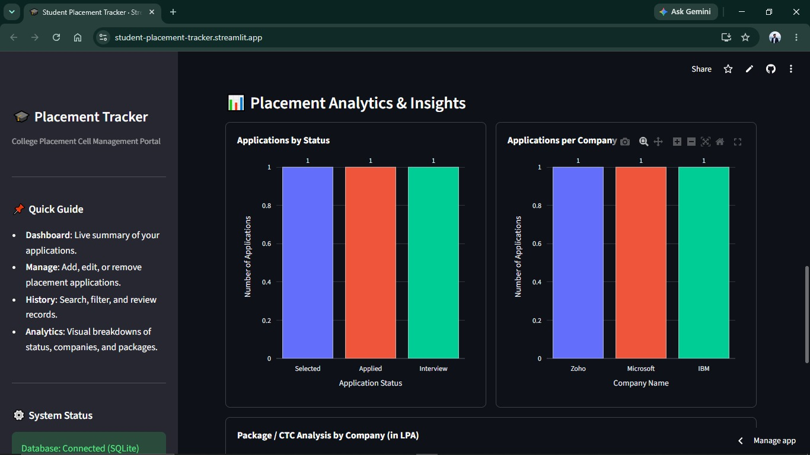

# 🎓 Student Placement Tracker

A web-based application built with Python and Streamlit to help students manage, track, and analyze their placement applications in one place.

## 📌 About the Project

Managing multiple placement applications can become difficult when keeping track of companies, job roles, application statuses, dates, and offered packages.

The Student Placement Tracker provides a centralized dashboard where students can record their placement applications, update their progress, search through applications, and visualize placement-related data.

## ✨ Features

- ➕ Add new placement applications
- 🏢 Store company and job role details
- 📅 Record application dates
- 📊 Track application status
  - Applied
  - Shortlisted
  - Interview
  - Selected
  - Rejected
- 💰 Record CTC/package information
- ✏️ Edit existing applications
- 🗑️ Delete applications
- 🔍 Search applications
- 🎯 Filter applications by status
- 📋 View application history
- 📈 Placement analytics dashboard
- 📊 Applications by status visualization
- 🏢 Applications by company visualization
- 💰 CTC analysis
- 💾 Store application data using SQLite
- ✅ Input validation for application details

## 🛠️ Technologies Used

| Technology   | Purpose                                |
|--------------|----------------------------------------|
| Python       | Core programming language              |
| Streamlit    | Web application interface              |
| SQLite       | Local database                         |
| Pandas       | Data handling and processing           |
| Plotly       | Interactive data visualization         |
| Git & GitHub | Version control and project management |

## 📊 Dashboard

The application provides an analytics dashboard to help students understand their placement progress.

The dashboard includes:

- Total applications
- Shortlisted applications
- Interview-stage applications
- Selected applications
- Rejected applications
- Applications by status
- Applications by company
- CTC analysis

## 📁 Project Structure

student-placement-tracker/
│
├── app.py
├── database.py
├── requirements.txt
├── README.md
└── .gitignore

## 🌐 Live Demo

Try the live application:

[**Launch Student Placement Tracker**]:(https://student-placement-tracker.streamlit.app/)

## 📸 Screenshots

### 📊 Dashboard

### ➕ Add Application

### 📋 Application Records

### 📈 Placement Analytics

